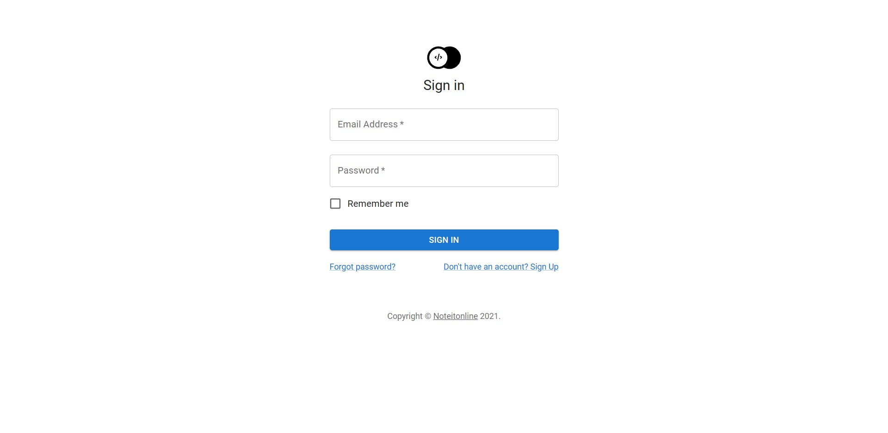
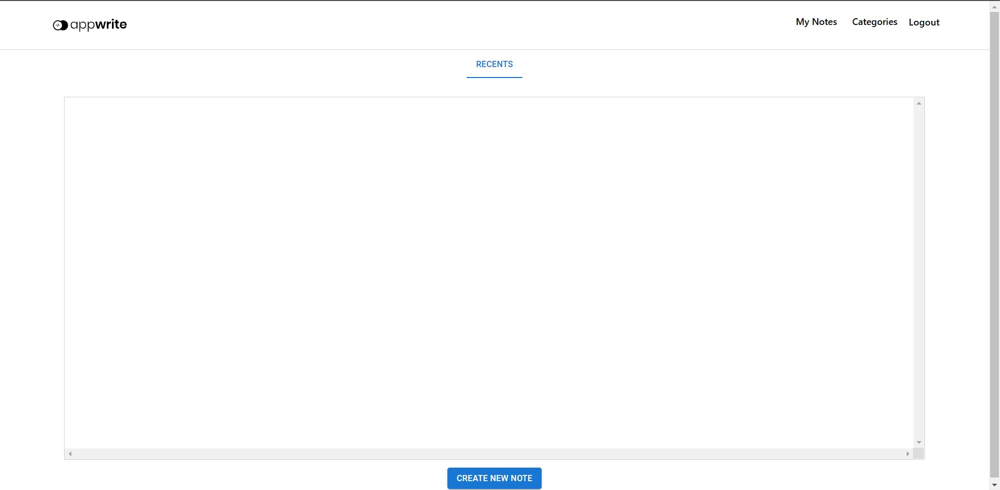
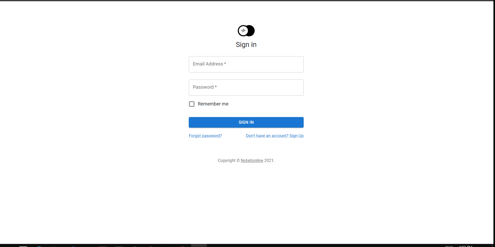
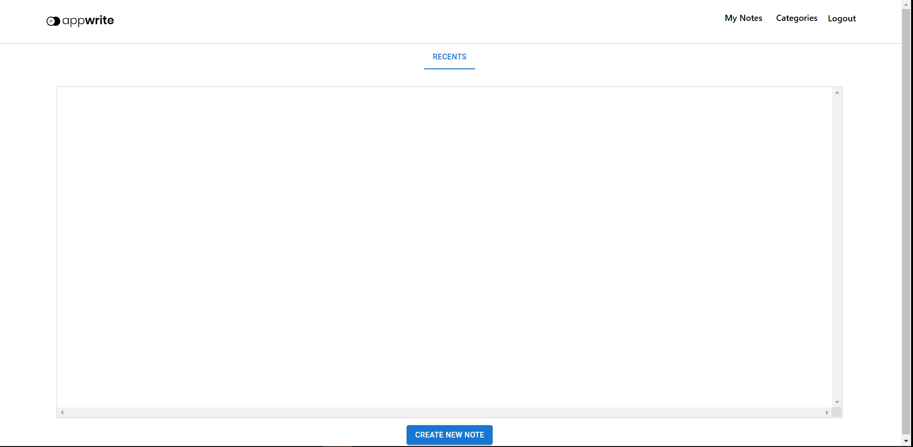
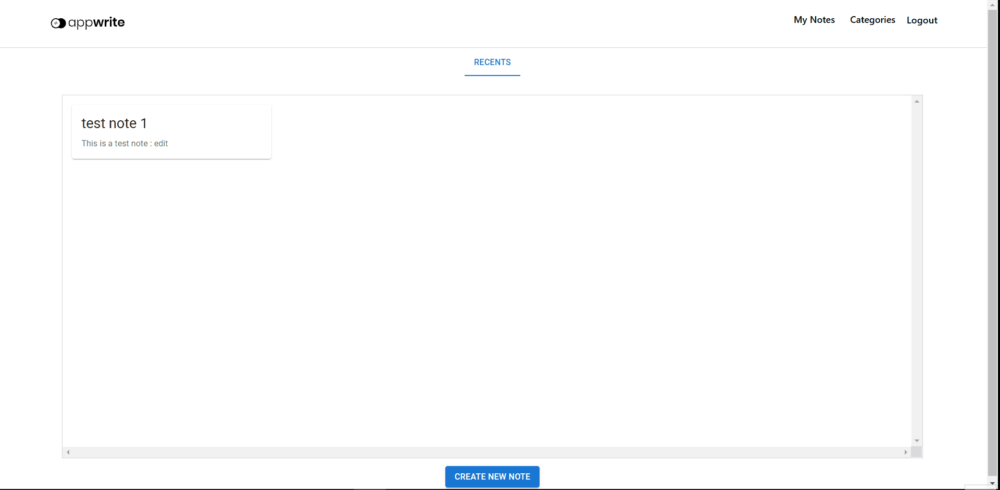

# **📑Notes App with React and Appwrite**
 

# 🔷About the app:
#### Its a notes app in which user can signin (Powered by appwrite's authentication) or signup and create notes with different categories. It store notes in appwrite's database and uses appwrite's API to create/edit and delete notes.
 
 

 ## ♦ Features
 1. User Authentication (Sign In and Sign Up)
 1. Create and delete notes.
 1. Add different categories.
 1. Manage your notes throughout different categories.
 
 ## Features Demo :
    1. User Authentication : 
 

    2. Create, Edit and Delete Notes : 

 

    3. Create Category and manage notes according   to categories.
    
    User can create different notes with different categories but new users get a default category called RECENTS which contains all the notes
    
 

 ### How to run?
    yarn start
or

    npm start

